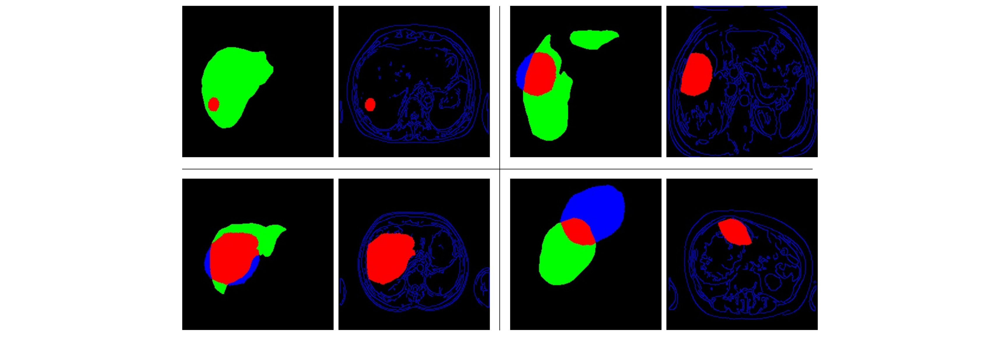

### Data Challenge SFR 2021 results from the **HB-IRIT-UIS team:** Hôpital Bicêtre - IRIT lab - UIS.

*Data Challenge Title:* Augmenting AI Data in the Service of Rare Tumors.

#### Team members and profiles
- Olivier Meyrignac (Radiologist MD PhD)
- Denis Kouamé (Statutory researcher PhD)
- Adrian Basarab (Statutory researcher PhD)
- Henry Arguello Fuentes (Statutory researcher PhD)
- Carlos Alberto Hinojosa Montero (PhD Student in computer science)
- Kevin Arias (PhD Student in computer science)
- Karen Yaneth Sánchez (PhD Student in engineering)

# Proposed Data Augmentation by the HB-IRIT-UIS team

This repository presents the solution created by our team to generate a database of 1000 MRIs from 100 MRIs of macrotrabecular carcinomas.
Based on the implemented algorithm, the user will be able to enter the number of cases to generate. The code will automatically create three new and different MRIs of hepatic macrotrabecular carcinomas for each desired case. To test the AI-based data augmentation method created by our team, you can go [to this link.]().

Figure outlines the method proposed by our team to address the challenge of augmenting MRI data with rare tumors.
Note that the framework was composed of 5 main stages: edge detection, manual liver segmentation, tumor masks transformation, generation of new masks, and training of a Pix2pix network.


### 1. Manual segmentation of livers

First, the MRIs of the 100 cases were manually segmented by the radiologist of the HB-IRIT-UIS team. For this activity, the open-source project Computer Vision Annotation tool [CVAT](https://cvat.org/auth/login) was used.


### 2. Edges detection

Second, our method uses an algorithm to compute an edge mask for each of the 300 provided MRIs. Specifically, we use the [Canny edge detection](https://github.com/csbanon/canny-edge-detector), an operator that uses a multi-stage algorithm to detect a wide range of edges in images. For this stage, 12 variations of the lower thresholding in the range between 30 and 120 are made for each image.


### 3. Transformation of tumor masks

Then, the tumor masks provided by the challenge are automatically transformed with the geometric operations: zoom, rotation and translation. Specifically, our code generates a new tumor mask for each new case to be generated.

### 4. Generation of new masks

Next, the new tumor masks are intersected with the liver segmentation of the source images, in order to ensure that the new tumor is located within the liver. In the figure, the liver is shown in green, tumor inside in red, and tumor outside in blue. Note in the figure that the edges mask (blue lines) calculated in (1) is combined with the mask of the tumor inside (in red). Four random examples of this step are presented below.



### 5. Training of a Pix2Pix network

Finally, all the MRI images are used to feed and train a [Pix2Pix adversarial network](https://arxiv.org/abs/1611.07004), capable of generating completely new MRI images of the liver with tumors, from edges and tumor masks. Implementation of ''Image-to-Image Translation with Conditional Adversarial Networks''.


# Steps to Run the Code
### 0. Requirements
The Code was tested only in Linux operating system. See the `requirements.txt` file for python packages requirements. Install them using
```
pip install -r requirements.txt
```
### 1. Data Preprocessing
Download the three data files ('data_1_2021.tar', 'data_2_2021.tar', 'data_3_2021.tar') and run file `preprocessing.py`
```
python preprocessing.py
```
 
