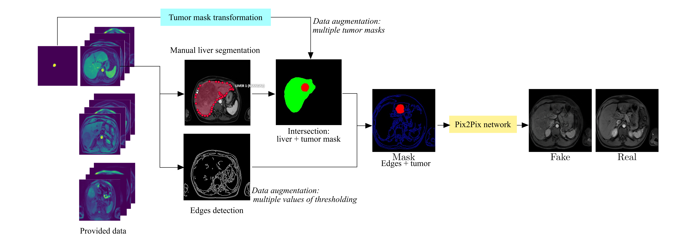

### Data Challenge SFR 2021 results from the **HB-IRIT-UIS team:** Hôpital Bicêtre - IRIT lab - UIS.

*Data Challenge Title:* Augmenting AI Data in the Service of Rare Tumors.

#### Team members and profiles
- Olivier Meyrignac (Radiologist MD PhD)
- Denis Kouamé (Statutory researcher PhD)
- Adrian Basarab (Statutory researcher PhD)
- Henry Arguello Fuentes (Statutory researcher PhD)
- Carlos Alberto Hinojosa Montero (PhD Student in computer science)
- Kevin Arias (PhD Student in computer science)
- Karen Yaneth Sánchez (PhD Student in engineering)

# Proposed Data Augmentation by the HB-IRIT-UIS team

This repository presents the solution created by our team to generate a database of 1000 MRIs from 100 MRIs of macrotrabecular carcinomas.
Based on the implemented algorithm, the user will be able to enter the number of cases to generate. The code will automatically create three new and different MRIs of hepatic macrotrabecular carcinomas for each desired case. To test the AI-based data augmentation method created by our team, you can go [to this link.](https://drive.google.com/drive/folders/1bDTZ85NSm0GxkLIpdkIFi9GJNArX5zYp?usp=sharing) The steps to run the code are described at the end of this repository.

Figure 1 outlines the method proposed by our team to address the challenge of augmenting MRI data with rare tumors.
Note that the framework was composed of 5 main stages: manual liver segmentation, edges detection, transformation of tumor masks, generation of new masks, and training of a Pix2Pix network.


*Fig. 1: General framework of the proposed AI Data augmentation in the service of rare tumors (The fake MRI in this figure is from training, not testing).*

### 1. Manual segmentation of livers

First, the MRIs of the 100 cases were manually segmented by the radiologist of the HB-IRIT-UIS team. For this activity, the open-source project Computer Vision Annotation tool [CVAT](https://cvat.org/auth/login) was used as shown in Fig. 2.


*Fig. 2: Random samples of the manual liver segmentation using the CVAT tool.*

### 2. Edges detection

Second, our method uses an algorithm to compute an edge mask for each of the 300 provided MRIs (see Fig. 3). Specifically, we use the [Canny edge detector](https://github.com/csbanon/canny-edge-detector), an operator that uses a multi-stage algorithm to detect a wide range of edges in images. In this stage, 12 variations of the lower threshold are made in the range between 30 and 120 for each image. At the end of our pipeline, each edge mask will allow a different new MRI image to be generated. Thus, the variation of the threshold value in this step enables a first data augmentation strategy.


*Fig. 3: An edge detection mask that uses the Canny algorithm with a random threshold within a defined range.*

### 3. Transformation of tumor masks

Then, the tumor masks provided by the challenge are automatically transformed with the geometric operations: zoom, rotation, and translation. Specifically, our code generates a new tumor mask for each new case to be generated. This step provides a second contribution to the data augmentation.

### 4. Generation of new masks: edges + tumor

Next, the new tumor masks are intersected with the liver segmentation of the source images, in order to ensure that the new tumor is located within the liver. In Fig. 4, the liver is shown in green, tumor inside in red, and tumor outside in blue. Notice that the edges mask (blue lines) calculated in (1) is combined with the mask of the tumor inside (in red). Four random examples of this step are presented below.


*Fig. 4: Four examples of (left) the intersection between the liver mask and the transformed tumor mask, and (right) the new edges and tumor mask.*

### 5. Training of a Pix2Pix network

Finally, all the MRI images are used to feed and train a [Pix2Pix adversarial network](https://arxiv.org/abs/1611.07004), capable of generating whole new MRI images of the liver with tumors, from the edges and tumor masks.

As a summary, this repository provides an algorithm trained with the method described here, which will create the following elements to generate X number of cases:
1) X new edge masks from random threshold values in a defined range, and
2) X different tumor masks from random transformations of sizes, rotations, and positions.
Tumor masks will intersect with liver masks to ensure tumor position. 

Finally, synthetic images will be created that preserve the quality, appearance, and spatial distribution of the images provided by the challenge. A folder with MRIs of 1000 cases generated with this method is available [at this link](https://drive.google.com/drive/folders/1LdoqQgOTkG80Nyf8VRmCnC6DbBg9-pNY?usp=sharing). In addition, in Fig. 5 are shown some examples of images that can be generated by this method.


*Fig. 5: Generated MRIs for two cases with the proposed method by the HB-IRIT-UIS team.*

# Steps to Run the Code

The following steps must be executed in the [Google Colab file available here.](Thttps://drive.google.com/drive/folders/1bDTZ85NSm0GxkLIpdkIFi9GJNArX5zYp?usp=sharing)

### 0. Requirements
The Code was tested only in Linux operating system. See the `requirements.txt` file for python packages requirements. Install them using
```
pip install -r requirements.txt
```

### 1. Data Preprocessing
Download the three data files ('data_1_2021.tar', 'data_2_2021.tar', 'data_3_2021.tar') and run file `preprocessing.py`
```
python preprocessing.py
```
### 2. Trained Model

Download the trained models [from here.](https://drive.google.com/drive/folders/1661I8jEImgGFBU-ofclQQGq_C7p-UPql?usp=sharing) 
These files must be downloaded into the Checkpoints folder: *"code/pix2pix/checkpoints"*
